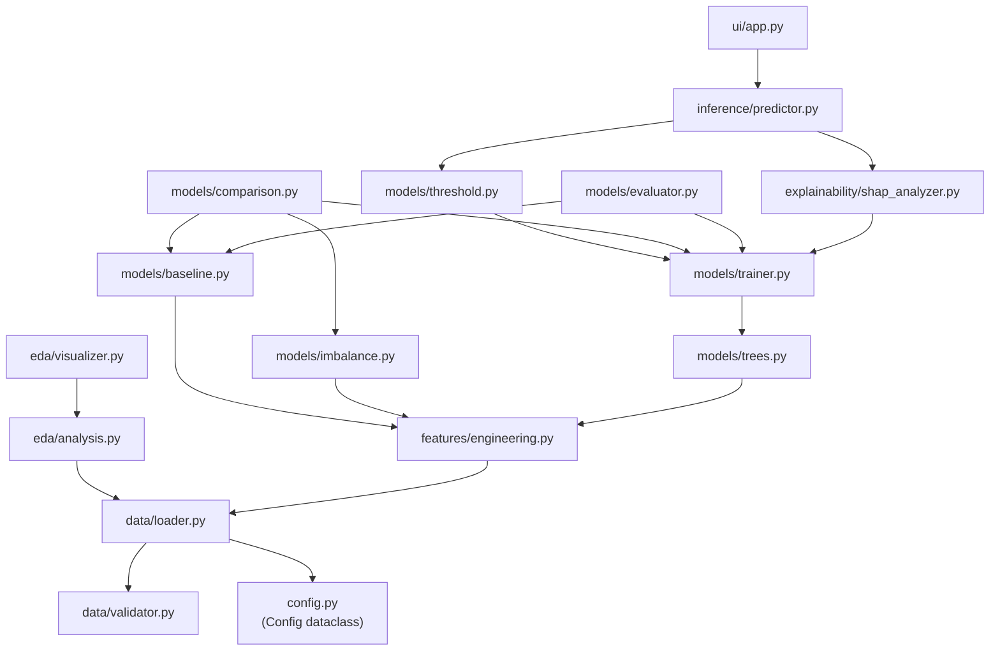

# RiskGuard AI — Card Transaction Fraud Detection & Risk Management

[](https://www.python.org/downloads/)

**Track 02: AI Risk Manager | Sub-Problem: Card Fraud Detection**

RiskGuard AI is a machine learning-based fraud risk detection platform that goes beyond binary classification. Designed for human risk analysts and automated triage policies, it provides:

- 📊 **Fraud Probability Scoring**: Continuous risk assessment calibrated against transaction distributions.
- 🎯 **Cost-Sensitive Decision Thresholds**: Risk policies aligned with operational costs rather than arbitrary 0.5 cutoffs.
- 🔍 **Actionable Explainability**: Top-N human-interpretable reasons for every flagged transaction using SHAP values.

---

## 📁 Complete Repository Architecture

```text
riskguard-ai/
│
├── .env.example                          # Sample env config (Kaggle credentials, paths)
├── .gitignore                            # Python / IDE ignore rules
├── requirements.txt                      # All project dependencies (pinned ranges)
├── pyproject.toml                        # Package build, pytest, and coverage config
├── README.md                             # Project overview, architecture, usage docs
│
├── docs/
│   └── architecture.md                   # System design & technical documentation
│
├── scripts/                              # Phase entry-point runners (CLI scripts)
│   ├── __init__.py
│   ├── run_eda.py                        # Phase 1 — EDA Pipeline
│   ├── run_baseline.py                   # Phase 2 — Logistic Regression Baseline
│   ├── run_imbalance_comparison.py       # Phase 3 — Imbalance Strategy Benchmark
│   ├── run_stronger_models.py            # Phase 4 — XGBoost / LightGBM CV & Threshold Tuning
│   ├── run_explainability.py             # Phase 5 — SHAP Global & Local Interpretability
│   └── run_inference.py                  # Phase 6 — CLI Inference Demonstration
│
├── src/
│   ├── riskguard.egg-info/               # Editable install metadata (auto-generated)
│   └── riskguard/                        # Main Python package
│       ├── __init__.py
│       ├── config.py                     # Env-based dataclass config (paths, thresholds, seeds)
│       │
│       ├── data/
│       │   ├── __init__.py
│       │   ├── loader.py                 # Dataset acquisition: local path or kagglehub download
│       │   └── validator.py              # Schema validation & data integrity checks
│       │
│       ├── eda/
│       │   ├── __init__.py
│       │   ├── analysis.py               # Pure statistical EDA functions (imbalance, corr, etc.)
│       │   └── visualizer.py             # Publication-ready dark-theme matplotlib visualizations
│       │
│       ├── features/
│       │   ├── __init__.py
│       │   └── engineering.py            # Feature transforms, log-Amount, time cyclical encoding, scaling
│       │
│       ├── models/
│       │   ├── __init__.py
│       │   ├── baseline.py               # Logistic Regression pipeline (Phase 2)
│       │   ├── imbalance.py              # Class weighting / SMOTE / undersampling strategies (Phase 3)
│       │   ├── trees.py                  # XGBoost & LightGBM model definitions (Phase 4)
│       │   ├── trainer.py                # Stratified K-Fold CV training pipeline (Phase 4)
│       │   ├── threshold.py              # Decision threshold optimizer (cost-sensitive policy)
│       │   ├── comparison.py             # Multi-model comparison runner
│       │   └── evaluator.py              # PR-AUC, F1@threshold, Recall@Precision metrics
│       │
│       ├── explainability/
│       │   ├── __init__.py
│       │   └── shap_analyzer.py          # Global SHAP summary + per-transaction waterfall (Phase 5)
│       │
│       ├── inference/
│       │   ├── __init__.py
│       │   └── predictor.py              # End-to-end scoring: transaction → risk score → action → top-3 reasons
│       │
│       ├── ui/
│       │   ├── __init__.py
│       │   └── app.py                    # Streamlit interactive demo application (Phase 6)
│       │
│       └── utils/
│           ├── __init__.py
│           ├── logging.py                # Centralized structured logger factory
│           ├── plotting.py               # Shared dark-theme styling & figure save routines
│           ├── metrics_reporter.py       # Markdown metrics report generator (Phase 2)
│           ├── comparison_reporter.py    # Multi-model comparison report generator (Phase 3/4)
│           ├── tree_reporter.py          # XGBoost/LightGBM result report generator (Phase 4)
│           └── explainability_reporter.py# SHAP interpretability report generator (Phase 5)
│
├── tests/
│   ├── __init__.py
│   ├── test_data_loader.py               # Dataset loading & schema validation tests
│   ├── test_analysis.py                  # Statistical EDA function unit tests
│   ├── test_features.py                  # Feature engineering transform tests
│   ├── test_baseline.py                  # Logistic Regression baseline tests
│   ├── test_imbalance.py                 # Imbalance strategy comparison tests
│   ├── test_trees.py                     # XGBoost and LightGBM model tests
│   ├── test_threshold.py                 # Decision threshold optimizer tests
│   ├── test_trainer.py                   # Stratified K-Fold CV trainer tests
│   ├── test_shap_analyzer.py             # SHAP explainer unit tests
│   ├── test_evaluator.py                 # Business metrics evaluation tests
│   └── test_predictor.py                 # End-to-end predictor / inference tests
│
└── outputs/                              # All generated artifacts (gitignored except .gitkeep)
    ├── .gitkeep
    ├── phase1/
    │   ├── 01_class_imbalance.png
    │   ├── 02_amount_time_distributions.png
    │   ├── 03_temporal_patterns.png
    │   ├── 04_vfeature_distributions.png
    │   ├── 05_correlation_analysis.png
    │   ├── 06_feature_separability.png
    │   ├── eda_summary.md
    │   └── phase1_results.md
    ├── phase2/
    │   ├── baseline_model.joblib
    │   ├── baseline_metrics.md
    │   └── baseline_threshold_curve.png
    ├── phase3/
    │   ├── imbalance_comparison.md
    │   ├── imbalance_prauc_comparison.png
    │   └── imbalance_threshold_curves.png
    ├── phase4/
    │   ├── xgboost_fraud_model.joblib     # Champion serialized model + preprocessing pipeline
    │   ├── model_comparison.md            # 5-fold CV & test evaluation report
    │   ├── pr_curves_comparison.png       # PR curves: LogReg vs XGBoost vs LightGBM
    │   └── threshold_policy_curves.png    # Precision / Recall / F1 across thresholds
    ├── phase5/
    │   ├── interpretability_report.md     # Global feature importance + flagged case breakdowns
    │   ├── shap_global_importance.png     # SHAP feature ranking bar chart
    │   ├── shap_waterfall_case_1.png
    │   ├── shap_waterfall_case_2.png
    │   └── shap_waterfall_case_3.png
    └── phase6/
        ├── inference_summary.json         # Archetypal transaction case breakdown
        ├── sample_batch_scored.csv        # Batch results: prob + risk tier + top-3 reasons
        └── production_bundle/
            ├── model.joblib               # Self-contained production model artifact
            └── metadata.json             # Model metadata: version, threshold, feature list
```

---

## 🔗 Module Dependency Map



---

## ⚙️ Setup & Installation

### Step 1 — Environment Setup (Fresh Clone)

```bash
# 1. Clone and enter the repo
git clone <repo-url>
cd riskguard-ai

# 2. Create and activate virtual environment
python -m venv .venv
.venv\Scripts\activate          # Windows
# source .venv/bin/activate     # macOS/Linux

# 3. Install the package in editable mode with all dependencies
pip install -e .
pip install -r requirements.txt

# 4. Configure environment
cp .env.example .env
# Edit .env — add KAGGLE_USERNAME / KAGGLE_KEY if using kagglehub
```

---

## 🚀 Running the Full Pipeline

### Step 2 — Run All Phases (in order)

```bash
# Phase 1 — EDA
python scripts/run_eda.py
# → outputs/phase1/ (6 PNGs + 2 markdown reports)

# Phase 2 — Logistic Regression Baseline
python scripts/run_baseline.py
# → outputs/phase2/ (model.joblib + metrics.md + threshold curve)

# Phase 3 — Imbalance Strategy Benchmark
python scripts/run_imbalance_comparison.py
# → outputs/phase3/ (comparison.md + 2 PNGs)

# Phase 4 — XGBoost/LightGBM + Threshold Tuning
python scripts/run_stronger_models.py
# → outputs/phase4/ (champion model.joblib + comparison.md + 2 PNGs)

# Phase 5 — SHAP Interpretability
python scripts/run_explainability.py
# → outputs/phase5/ (report.md + global importance PNG + 3 waterfall PNGs)

# Phase 6 — CLI Inference + Production Bundle
python scripts/run_inference.py
# → outputs/phase6/ (inference_summary.json + batch_scored.csv + production_bundle/)
```

### Step 3 — Launch the Streamlit UI

```bash
streamlit run src/riskguard/ui/app.py
# → Opens interactive demo in browser at http://localhost:8501
```

**Phase 4 outputs** (`outputs/phase4/`):
- `xgboost_fraud_model.joblib` — Serialized champion model with preprocessing pipeline
- `model_comparison.md` — 5-fold CV and test set evaluation report
- `pr_curves_comparison.png` — Precision-Recall curves (LogReg vs XGBoost vs LightGBM)
- `threshold_policy_curves.png` — Precision, Recall, and F1 across decision thresholds

**Phase 5 outputs** (`outputs/phase5/`):
- `interpretability_report.md` — Global feature importance & sample flagged case breakdowns
- `shap_global_importance.png` — Global SHAP feature ranking bar chart
- `shap_waterfall_case_*.png` — Local risk driver waterfall charts for flagged transactions

**Phase 6 outputs** (`outputs/phase6/`):
- `production_bundle/` — Self-contained artifact bundle (`model.joblib`, `metadata.json`)
- `sample_batch_scored.csv` — Batch transaction triage results with probabilities and risk reasons
- `inference_summary.json` — Detailed case breakdown for archetypal transactions

---

## 🧪 Testing

### Step 4 — Run the Full Test Suite

```bash
pytest
# or with coverage
pytest --cov=src --cov-report=term-missing
```

**Test coverage targets:**

| Test File | Covers |
|---|---|
| `test_data_loader.py` | `data/loader.py`, `data/validator.py` |
| `test_analysis.py` | `eda/analysis.py` |
| `test_features.py` | `features/engineering.py` |
| `test_baseline.py` | `models/baseline.py` |
| `test_imbalance.py` | `models/imbalance.py` |
| `test_trees.py` | `models/trees.py` |
| `test_threshold.py` | `models/threshold.py` |
| `test_trainer.py` | `models/trainer.py` |
| `test_shap_analyzer.py` | `explainability/shap_analyzer.py` |
| `test_evaluator.py` | `models/evaluator.py` |
| `test_predictor.py` | `inference/predictor.py` |

---

## ✅ Verify Key Outputs

### Step 5 — Confirm All Phase Outputs Are Present

```bash
ls outputs/phase1/   # 6 PNGs + 2 .md files
ls outputs/phase2/   # model.joblib + metrics.md + PNG
ls outputs/phase3/   # comparison.md + 2 PNGs
ls outputs/phase4/   # xgboost_fraud_model.joblib + comparison.md + 2 PNGs
ls outputs/phase5/   # interpretability_report.md + 4 PNGs
ls outputs/phase6/   # inference_summary.json + sample_batch_scored.csv + production_bundle/
ls outputs/phase6/production_bundle/   # model.joblib + metadata.json
```

---

## 🔖 Git & Release

### Step 6 — Git & Release Hygiene

```bash
# Stage all source code (outputs are gitignored except .gitkeep)
git add src/ scripts/ tests/ docs/ README.md pyproject.toml requirements.txt .env.example

# Final commit
git commit -m "feat: complete Phase 6 — packaging, inference engine & Streamlit UI"

# Tag release
git tag -a v1.0.0 -m "RiskGuard AI — all 6 phases complete"
git push origin main --tags
```

### Step 7 — (Optional) Build Distributable Package

```bash
pip install build
python -m build
# → dist/riskguard-0.1.0-py3-none-any.whl
# → dist/riskguard-0.1.0.tar.gz
```

---

## 📊 Implementation Status

| Phase | Script | Status | Key Output |
|---|---|---|---|
| **Phase 1** — EDA | `run_eda.py` | ✅ Complete | `outputs/phase1/` — 6 charts + 2 reports |
| **Phase 2** — Baseline | `run_baseline.py` | ✅ Complete | `outputs/phase2/baseline_model.joblib` |
| **Phase 3** — Imbalance | `run_imbalance_comparison.py` | ✅ Complete | `outputs/phase3/imbalance_comparison.md` |
| **Phase 4** — XGBoost/LGBM | `run_stronger_models.py` | ✅ Complete | `outputs/phase4/xgboost_fraud_model.joblib` |
| **Phase 5** — SHAP | `run_explainability.py` | ✅ Complete | `outputs/phase5/interpretability_report.md` |
| **Phase 6** — Inference + UI | `run_inference.py` + `ui/app.py` | ✅ Complete | `outputs/phase6/production_bundle/` |

---

## 📋 Implementation Roadmap

- **Phase 1 — Setup & EDA**: Data validation, imbalance confirmation, temporal and feature distribution profiling.
- **Phase 2 — Baseline Model**: Stratified split, Logistic Regression baseline, PR-AUC / Recall@Precision metrics.
- **Phase 3 — Class Imbalance Handling**: Benchmarking class weighting vs SMOTE vs undersampling.
- **Phase 4 — Stronger Models & Threshold Tuning**: Tuned XGBoost/LightGBM with 5-fold Stratified CV & explicit risk policy threshold optimization.
- **Phase 5 — Interpretability**: Global feature importances & per-transaction SHAP reason codes.
- **Phase 6 — Packaging & Inference**: Fast inference engine (`transaction → risk score → action → top 3 reasons`) & interactive Streamlit demo UI.
